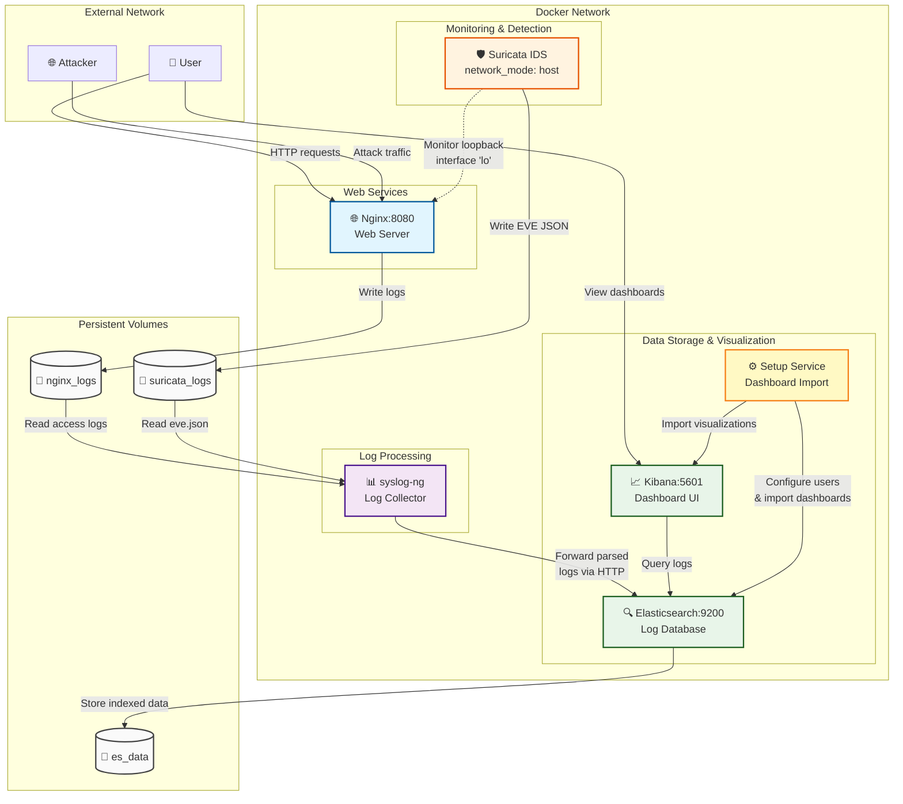
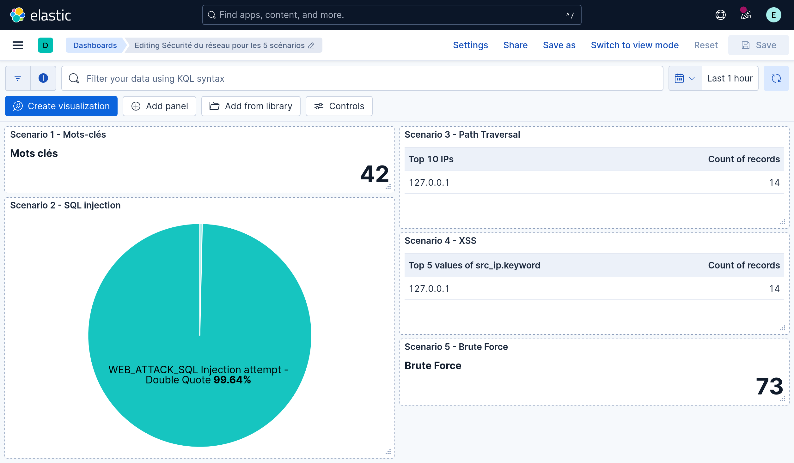
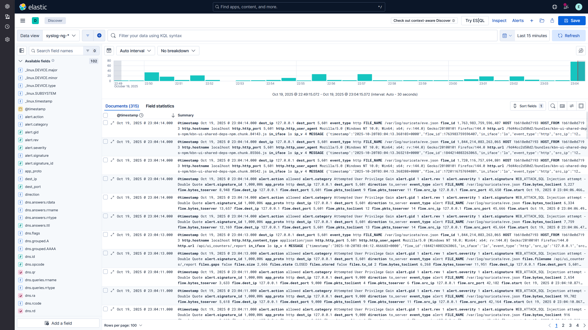

# Système de Surveillance de Sécurité

<div align="center">


</div>

Solution de surveillance de sécurité utilisant Suricata IDS, Elasticsearch + Kibana, syslog-ng et Nginx pour la détection d'intrusions et l'analyse de logs.

## Architecture

- **Suricata** : Système de détection d'intrusions réseau (IDS)
- **Elasticsearch** : Stockage et indexation des logs
- **Kibana** : Interface de visualisation des logs et tableaux de bord
- **syslog-ng** : Collecte et transmission des logs. Va formater les logs de Suricata dans un format que va pouvoir exploiter ElasticSearch.
- **Nginx** : Serveur web pour générer du trafic de test

## Documentation

📖 **[Consignes du Projet](docs/consignes.md)** - Objectifs et barème détaillé

📋 **[Justifications des Choix Techniques](docs/choix_techniques.md)** - Pourquoi Docker, Suricata, etc.

⚔️ **[Scénarios d'attaques](Scenarios_attaques/Launch.md)** - Explication du lancement des attaques et descriptions détaillées

## Démarrage Rapide

1. **Cloner le dépôt**
   ```bash
   git clone https://github.com/PumpeDie/security-it-project1
   cd security-it-project1
   ```

2. **Démarrer tous les services**
   ```bash
   docker compose up -d
   ```

3. **Vérifier que les services fonctionnent**
   ```bash
   docker compose ps
   ```

4. **Accéder aux interfaces**
   - Application web : http://localhost:8080
   - Tableau de bord Kibana : http://localhost:5601
   - API Elasticsearch : http://localhost:9200

## Vue d'Ensemble des Services



### Services Détaillés

### Elasticsearch

- **Port** : 9200
- **Objectif** : Stocke et indexe les logs de sécurité
- **Configuration** : Mode nœud unique avec sécurité désactivée pour la simplicité

Identifiant
:   `elastic`

Mot de passe
:   `MetNousCent`

### Kibana

- **Port** : 5601
- **Objectif** : Visualise les logs et fournit des tableaux de bord de sécurité
- **Dépendances** : Nécessite qu'Elasticsearch soit en fonctionnement


*Vue d'ensemble des 5 scénarios d'attaque avec compteurs et graphiques*


*Exploration des logs collectés par Suricata*

### Suricata

- **Objectif** : Surveille le trafic réseau et détecte les intrusions
- **Configuration** : Surveille l'interface loopback avec logging JSON activé
- **Sortie des logs** : `/var/log/suricata/eve.json`

### syslog-ng

- **Objectif** : Collecte les logs de Suricata et Nginx
- **Configuration** : Redirige les logs vers la sortie console
- **Sources** : Logs JSON Suricata, logs d'accès Nginx

### Nginx

- **Port** : 8080
- **Objectif** : Serveur web pour les tests et la génération de trafic HTTP
- **Logs** : Logs d'accès et d'erreur collectés par syslog-ng

## Fichiers de Configuration

```
src/
├── config/
│   ├── nginx/nginx.conf          # Configuration du serveur web Nginx
│   ├── suricata/suricata.yaml    # Configuration de l'IDS Suricata, passerelle entre ElasticSearch et Suricata
│   └── syslog-ng/syslog-ng.conf  # Configuration de collecte des logs
│   └── elasticsearch.conf        # Configuration du stockage des logs
└── web/index.html                # Application web de test
```

## Arrêter le Système

```bash
docker compose down
```

Pour supprimer tous les volumes de données :

```bash
docker compose down -v
```

## Fonctionnalités de Sécurité

- Surveillance du trafic réseau avec Suricata
- Collecte centralisée des logs avec syslog-ng
- Analyse des logs en temps réel avec Elasticsearch
- Tableaux de bord de sécurité visuels avec Kibana
- Règles de détection et seuils configurables

## Analyse et conclusion

### Limites du projet

- **Limites de détection** : Suricata n'est sensible qu'aux menaces renseignés dans la configuration.

- **Contenairisation** : Le projet est dans plusieurs containers, cela est pratique pour travailler dessus depuis des environnements différents. Néanmoins, pour déployer notre solution, des ajustements de toutes les configs sont nécessaires.

- **Injection SQL** : la règle Suricata semble mal écrite, et de nouvelles alertes sont envoyées à intervalles réguliers, sans nouvelles attaques. **Création de faux positifs**

### Améliorations possibles

- Utilisation d'un autre IDS/IPS
- Automatisation de l'envoi d'alertes
- Utilisation d'autres règles Suricata

### Perspectives technologiques

- Intégration d'un SOAR pour répondre aux alertes

---

## 👥 Contributeurs

<div align="center">

<table>
<tr>
    <td align="center">
    <a href="https://github.com/PumpeDie">
        
        <br />
        <sub><b>PumpeDie</b></sub>
        <br />
        <sub>Samuel PLET</sub>
    </a>
    </td>
    <td align="center">
    <a href="https://github.com/realnitsuj">
        
        <br />
        <sub><b>realnitsuj</b></sub>
        <br />
        <sub>Justin BOSSARD</sub>
    </a>
    </td>
    <td align="center">
    <a href="https://github.com/paulm123456789">
        
        <br />
        <sub><b>paulm123456789</b></sub>
        <br />
        <sub>Paul MATHE</sub>
    </a>
    </td>
    <td align="center">
    <a href="https://github.com/Go-GoZeppeli">
        
        <br />
        <sub><b>Go-GoZeppeli</b></sub>
        <br />
        <sub>Mattéo GOUHIER</sub>
    </a>
    </td>
</tr>
</table>

</div>

---

<div align="center">
  <sub>Projet réalisé dans le cadre du cours de Sécurité Informatique - UQAC 2025</sub>
</div>
