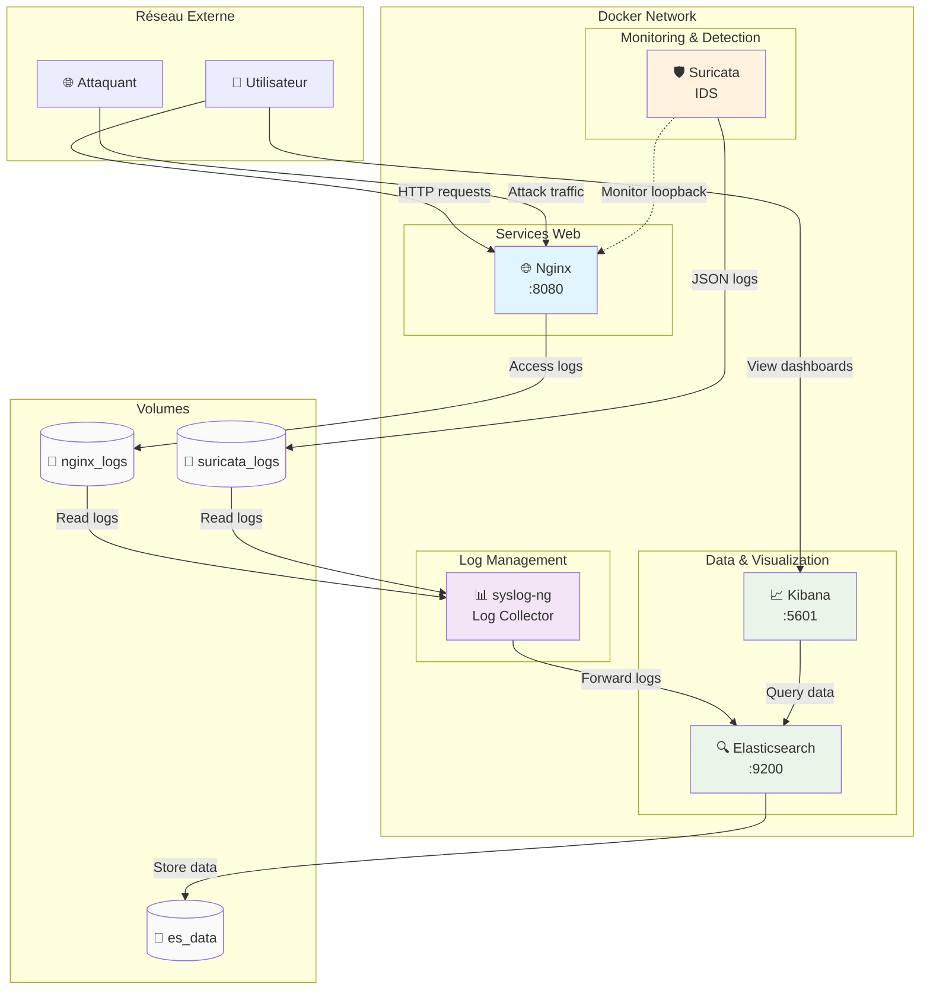

# Système de Surveillance de Sécurité

<div align="center">


</div>

Solution de surveillance de sécurité utilisant Suricata IDS, Elasticsearch + Kibana, syslog-ng et Nginx pour la détection d'intrusions et l'analyse de logs.

## Architecture

- **Suricata** : Système de détection d'intrusions réseau (IDS)
- **Elasticsearch** : Stockage et indexation des logs
- **Kibana** : Interface de visualisation des logs et tableaux de bord
- **syslog-ng** : Collecte et transmission des logs. Va formater les logs de Suricata dans un format que va pouvoir exploiter ElasticSearch.
- **Nginx** : Serveur web pour générer du trafic de test

## Documentation

📖 **[Consignes du Projet](docs/consignes.md)** - Objectifs et barème détaillé

📋 **[Justifications des Choix Techniques](docs/choix_techniques.md)** - Pourquoi Docker, Suricata, etc.

 ⚔️ **[Scénarios d'attaques](Scenarios_attaques/Launch.md)** - Explication du lancement des attaques et descriptions détaillées

## Démarrage Rapide

1. **Cloner le dépôt**
   ```bash
   git clone https://github.com/PumpeDie/security-it-project1
   cd security-it-project1
   ```

2. **Démarrer tous les services**
   ```bash
   docker compose up -d
   ```

3. **Vérifier que les services fonctionnent**
   ```bash
   docker compose ps
   ```

4. **Accéder aux interfaces**
   - Application web : http://localhost:8080
   - Tableau de bord Kibana : http://localhost:5601
   - API Elasticsearch : http://localhost:9200

## Vue d'Ensemble des Services


```mermaid
graph TB
    subgraph "Réseau Externe"
        A[🌐 Attaquant]
        U[👤 Utilisateur]
    end
    
    subgraph "Docker Network"
        subgraph "Services Web"
            N[🌐 Nginx<br/>:8080]
        end
        
        subgraph "Monitoring & Detection"
            S[🛡️ Suricata<br/>IDS]
        end
        
        subgraph "Log Management"
            SL[📊 syslog-ng<br/>Log Collector]
        end
        
        subgraph "Data & Visualization"
            E[🔍 Elasticsearch<br/>:9200]
            K[📈 Kibana<br/>:5601]
        end
    end
    
    subgraph "Volumes"
        V1[(📁 nginx_logs)]
        V2[(📁 suricata_logs)]
        V3[(📁 es_data)]
    end
    
    %% Traffic flows
    U -->|HTTP requests| N
    A -->|Attack traffic| N
    
    %% Network monitoring
    S -.->|Monitor loopback| N
    
    %% Log collection
    N -->|Access logs| V1
    S -->|JSON logs| V2
    V1 -->|Read logs| SL
    V2 -->|Read logs| SL
    SL -->|Forward logs| E
    
    %% Data storage & visualization
    E -->|Store data| V3
    K -->|Query data| E
    U -->|View dashboards| K
    
    %% Styling
    classDef webService fill:#e1f5fe
    classDef security fill:#fff3e0
    classDef logging fill:#f3e5f5
    classDef storage fill:#e8f5e8
    classDef volume fill:#fafafa
    
    class N webService
    class S security
    class SL logging
    class E,K storage
    class V1,V2,V3 volume
```

### Services Détaillés

### Elasticsearch
- **Port** : 9200
- **Objectif** : Stocke et indexe les logs de sécurité
- **Configuration** : Mode nœud unique avec sécurité désactivée pour la simplicité

### Kibana
- **Port** : 5601
- **Objectif** : Visualise les logs et fournit des tableaux de bord de sécurité
- **Dépendances** : Nécessite qu'Elasticsearch soit en fonctionnement

### Suricata
- **Objectif** : Surveille le trafic réseau et détecte les intrusions
- **Configuration** : Surveille l'interface loopback avec logging JSON activé
- **Sortie des logs** : `/var/log/suricata/eve.json`

### syslog-ng
- **Objectif** : Collecte les logs de Suricata et Nginx
- **Configuration** : Redirige les logs vers la sortie console
- **Sources** : Logs JSON Suricata, logs d'accès Nginx

### Nginx
- **Port** : 8080
- **Objectif** : Serveur web pour les tests et la génération de trafic HTTP
- **Logs** : Logs d'accès et d'erreur collectés par syslog-ng

## Fichiers de Configuration

```
src/
├── config/
│   ├── nginx/nginx.conf          # Configuration du serveur web Nginx
│   ├── suricata/suricata.yaml    # Configuration de l'IDS Suricata, passerelle entre ElasticSearch et Suricata
│   └── syslog-ng/syslog-ng.conf  # Configuration de collecte des logs
│   └── elasticsearch.conf        # Configuration du stockage des logs
└── web/index.html                # Application web de test
```

## Arrêter le Système

```bash
docker compose down
```

Pour supprimer tous les volumes de données :
```bash
docker compose down -v
```

## Fonctionnalités de Sécurité

- Surveillance du trafic réseau avec Suricata
- Collecte centralisée des logs avec syslog-ng
- Analyse des logs en temps réel avec Elasticsearch
- Tableaux de bord de sécurité visuels avec Kibana
- Règles de détection et seuils configurables
